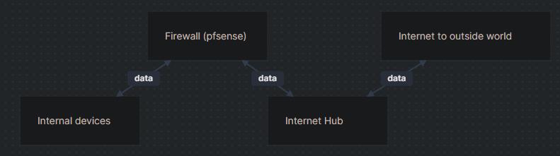

# Setting up pfsense

## What is Pfsense?

Secure networks start here.™ With thousands of enterprises using pfSense® software, it is rapidly becoming the world's most trusted open source network security solution.

download from page: [https://www.pfsense.org/download/](https://www.pfsense.org/download/)

## Network Setup

In a simple setup, basically this is my current aims of the network. This can be put in any type of network to change the flow of traffic moving from one device to another.

.png>)

## Downloading the files

So after heading over to the downloads page and downloading the file, the current latest version of todays' date writing this kb is 16/09.2023.

.png>)

Since I am going to be installing this on a virtual machine I will be choosing this option. If you ned to choose a different option, please refer to the official site for different installation types depending on your hardware.


I will be using Vmware workstation as this is free for personal usage.



So you should now have the following files:

* Virtual Machine of your choice installed
* ISO ready to import into your virtual machine


For me it came in as .gz file , just extract with a file archiver like 7zip to get the .iso file.


## Setting up the vm

So within Vmware for me it was a simple choose a new virtual machine and choose the extracted iso disc file.

 (1).png>)

Then I kept hitting next till the end.\


Make sure you allocate enough resources for the machine otherwise I have had strange issues so as a minimum allocate the following settings:\


Wait a short amount of time for it to boot up.


Quick coffee break while it install and boots up.


.png>)

Keep hitting next until you get to:


.png>)

Press the **Space Bar** to select the hard drive you want to save into.

.png>)

Are you sure you want to delete all the files. Yes


Coffee break while it configures what you put in and installs the software on the allocated space you provided for it.


.png>)

Right its all setup, but not fully configured.

So now I am going to shutdown the pfsense vm and change network segments following my setup from the networking diagram for my network.

For the pfsense vm:

.png>)

.png>)

The Lan segment will act to connect to my internal devices.

The NAT will give the pfsense access for internet.

For the internal device:

.png>)

.png>)

This machine will connect to the Lan segment I have specfied in the pfsense vm settings.


There are some checks you can checkk within pfsense to check if this has been setup correctly. If you have already connected your other machines you will see an IP in the WAN.

I did a ping test on the pfsense machine and recieved a reply to make sure the NAT was working as exspected.

.png>)

This is the IP I will go to on my internal machine to get to the web configurator.

192.168.1.1

.png>)

advanced > continue anyways.


if for any reason you cannot get internet access on the internal machine, I would suggest checking your Lan Segmentation setup or reinstall pfsense.


## Login details

Username: admin

Password: pfsense


Always remember to change default logins and passwords if you are using this in production.


You can just hit next for the quick complete setup.

.png>)

I would recommend to change the LAN IP to prevent people to attempting to attack you.

.png>)

After theses changes since we are not longer using the default IP we will need to release the IP address and get a new one. You can do this on windows with the following commands:

```
ipconfig /release
ipconfig /renew
```

\
You are now all setup as a minimum requirement, now depending on what you are looking to setup it is up to you. So on my next article I will show you my current test setup that can give you some ideas.

If this content helps or you have some feedback, do not hesitate and reach out to me on [X](https://twitter.com/xSamChau) or formally known as [Twitter](https://twitter.com/xSamChau).

\
