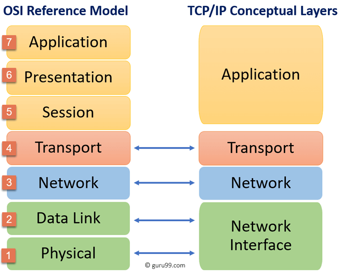

# Star

A **Star** topology is a computer network topology in which all devices are connected to a **Central Hub** or switch.&#x20;

The **Central Hub** acts as the central point of connection and services communication between all the devices in the network.

Each device in the network, such as computers, printers, or servers are connected directly to the **Central Hub** using separate network cables / Wi-Fi.

The easy way to think of this type of network is like your Internet at home.

When one device is affected on the network, all of the other devices are not affected and will continue to operate.&#x20;

It can isolate congestion to specific devices while other devices remain unaffected.

One of the key advantages of **Star** networks is the simplicity and scalability of the network.

However, the drawback of the **Star** network is that if the **Central Hub** is affected, then all devices on the network will also be affected.

Overall, the **Star** network is useful in many local area networks and small to medium-sized enterprise networks.
